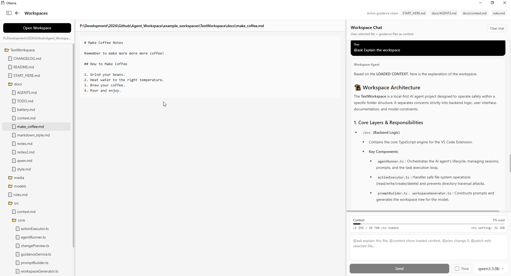
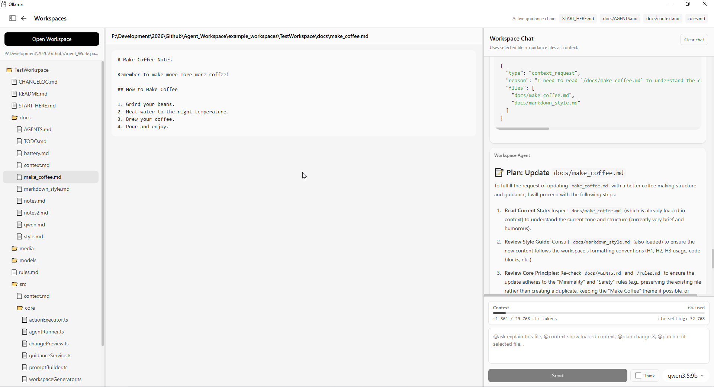
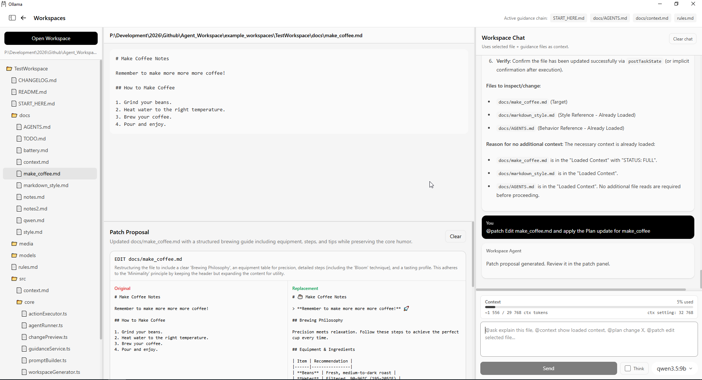
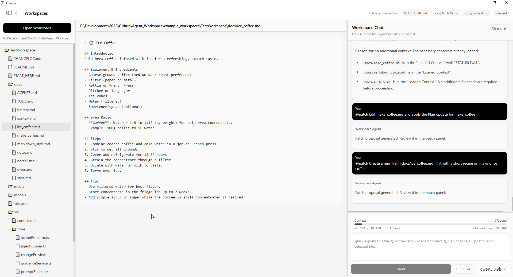
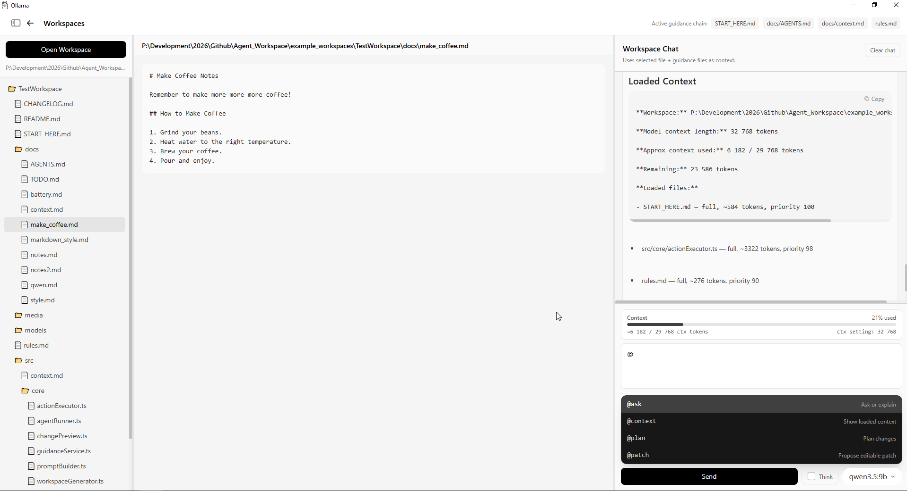

# Ollama — Workspace UI Experiment

This fork extends the original Ollama app with a **local-first, workspace-aware coding agent UI**.

> 👉 Original project: https://github.com/ollama/ollama

---

## Workspace UI POC
> *FYI This workspace is filled with random stuff by now while testing*

  
  
  
  


---

# What this actually is

A local-first coding agent runtime
that safely reads, reasons about, and edits a workspace
using structured context and user-approved patches.

---

# Features

## Workspace awareness

* VS Code–style file explorer
* File selection + viewer
* Workspace map (model-aware file structure)
* Recent workspace memory (quick reopen)

---

## Context system (CORE)

* **ContextManager (stateful memory layer)**
* Guidance chain detection:

  * `START_HERE.md`
  * `rules.md`
  * `AGENTS.md`
  * `context.md`
* Smart context loading:

  * only relevant files
  * no full project stuffing
* Multi-round context request loop
* Prevents duplicate reads + infinite loops
* Token-aware context budgeting
* Full vs summary loading for large files

👉 The agent does **not guess** — it reads only what it needs.

---

## Agent interaction

Command-driven interface:

* `@ask` → explain / inspect
* `@plan` → structured plan
* `@patch` → propose changes
* `@context` → inspect current context

Additional:

* Command autocomplete (`@` menu)
* Streaming responses
* Model picker (per request)
* Optional “Think” mode
* Chat history persistence

---

## Patch system (core capability)

Structured patch pipeline:

```json
{
  "type": "patch_proposal",
  "files": [...]
}
```

Supports:

* `edit`
* `create`

Safety features:

* Workspace root enforcement (no escape)
* Path normalization (fixes `/docs` vs `docs`)
* Create-task detection (no unnecessary reads)
* JSON validation + fallback handling
* Prevents invalid patch outputs

Patch panel:

* original vs replacement view
* apply / clear controls
* per-file reasoning

---

## Context + Model awareness

* Dynamic context size tracking
* Uses Ollama model context settings (when available)
* UI shows:

  * tokens used
  * tokens remaining
  * model context limit

---

## UX improvements

* Context usage panel (live token bar)
* Patch “busy / preparing” indicator
* Cleaner chat output (no raw JSON spam)
* Auto scroll + focus
* Clear chat button
* Improved command matching behavior

---

# Current System Flow

```text
User prompt
→ ContextManager builds context
→ Model responds

→ If more context needed:
    request files
    load + cache
    retry

→ Final result:
    explanation OR patch proposal

→ User reviews → apply patch
```

---

# Current Status

Branch: `workspace-ui`
State: **Functional prototype → evolving into agent runtime**

---

## What works well

* Context-aware reasoning (no hallucinated file content)
* Multi-file understanding
* Safe patch generation (create/edit)
* Context request loop (stable + bounded)
* Token-aware context control

---

## What’s next

### 1. Patch matcher engine (IN PROGRESS)

* whitespace normalization
* anchor-based matching
* confidence scoring

### 2. Diff viewer

* proper code diff instead of raw snippets

### 3. Context persistence

* retain context across sessions

### 4. Memory layer (embeddings)

* semantic retrieval for large projects

### 5. Auto agent mode

* plan → act → repeat loop

---

# Design philosophy

Guidance-driven
+ Context-on-demand
+ Safe execution


NOT:

* full project stuffing
* blind edits
* uncontrolled agents

---

# Example workflow

1. Open workspace
2. Select a file

```
@ask explain this file
```

3. Let agent fetch missing context

```
@plan refactor this logic
```

4. Generate change:

```
@patch add validation
```

5. Review → Apply

---

# One-line summary


A local-first, context-aware coding agent that safely reads and edits your project using structured reasoning and controlled patches.

