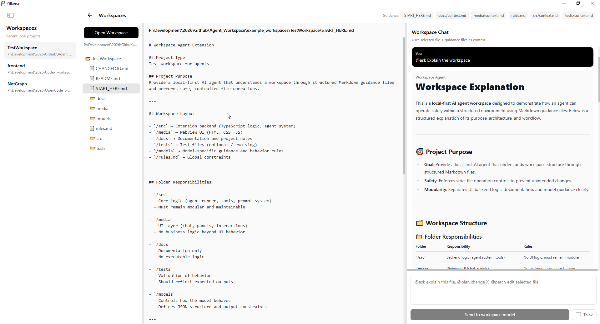
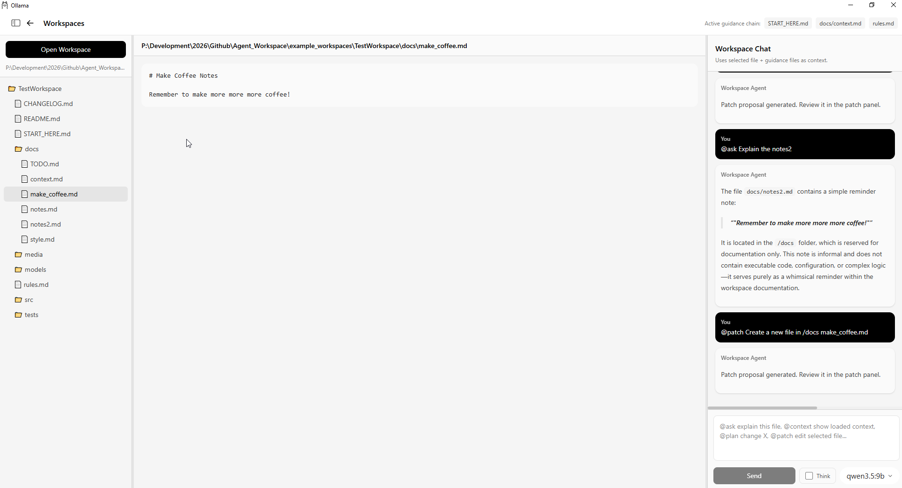
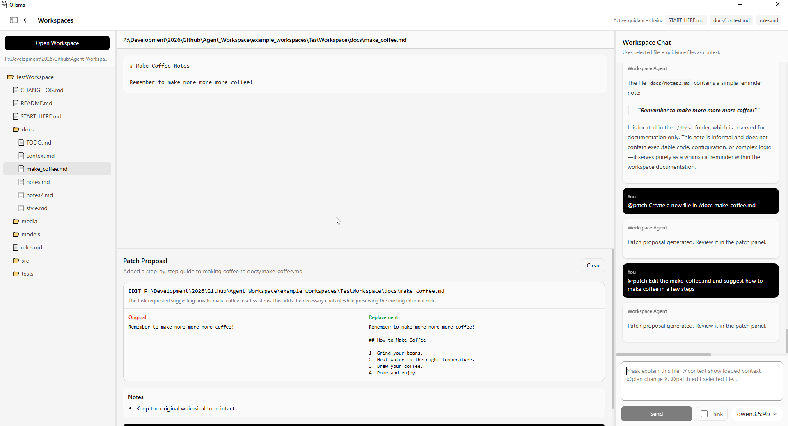
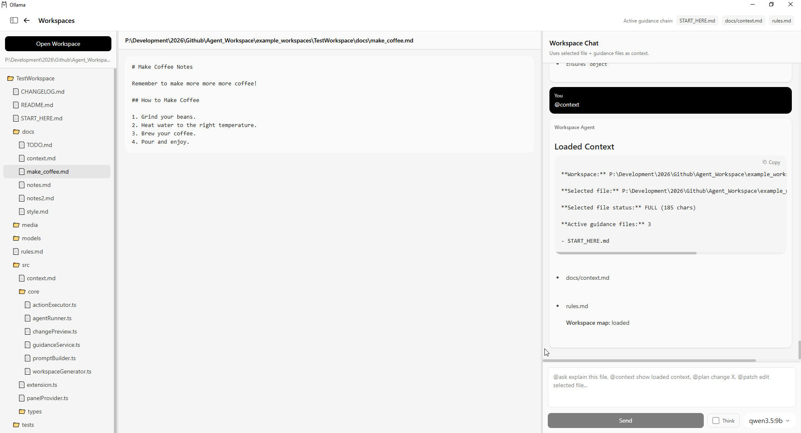

# Ollama — Workspace UI Experiment

This fork extends the original Ollama app with a **local workspace-aware agent UI**.

> 👉 Original project: [https://github.com/ollama/ollama](https://github.com/ollama/ollama)

---

## Workspace UI POC






---

## What’s added

### Workspace awareness

* Local workspace explorer (VS Code–style)
* File viewer + selection
* Workspace map (model knows available files)
* Recent workspace memory (quick reopen)

### Context system

* Guidance chain detection (`START_HERE.md`, `AGENTS.md`, `context.md`, `rules.md`)
* Structured context injection (no full project stuffing)
* Auto context loading via model requests
* Multi-round context fetching loop (agent can request more files)

### Agent interaction

* Command system:

  * `@ask` → explain / inspect
  * `@plan` → structured planning
  * `@patch` → propose changes
  * `@context` → inspect loaded context
* Command autocomplete UI (`@` menu + keyboard navigation)
* Streaming responses (live model output)
* Model picker (switch models per request)
* Optional “Think” mode toggle

### Patch system (core feature)

* Structured patch proposals (JSON → UI panel)
* Supports:

  * `edit`
  * `create`
* Safe apply pipeline:

  * Resolve relative paths → workspace root
  * Prevent writes outside workspace
  * Snippet-based patching (no blind overwrite)
* Patch panel with:

  * original vs replacement view
  * apply / clear controls

### UX improvements

* Chat history persistence (localStorage)
* Auto scroll + auto focus
* Cleaner output (raw JSON hidden from chat)
* Softened UI (less harsh white)

---

## Status

Prototype / experimental branch (`workspace-ui`)

Current capabilities:

```text
LLM → requests context → loads files → reasons → proposes patch → user approves → writes safely
```

---

## Example workflow

1. Open a workspace folder
2. Select a file
3. Ask:

   ```
   @ask explain this file
   ```
4. Let agent fetch missing context automatically
5. Plan:

   ```
   @plan refactor this logic
   ```
6. Propose change:

   ```
   @patch add validation
   ```
7. Review → Apply patch

---


